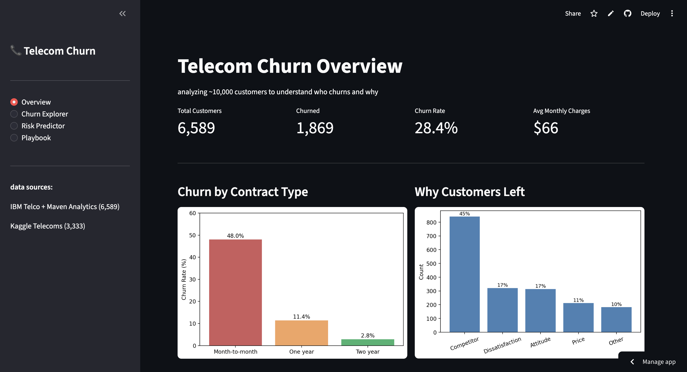
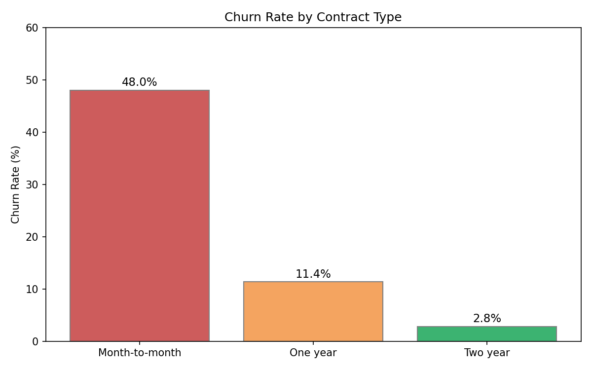
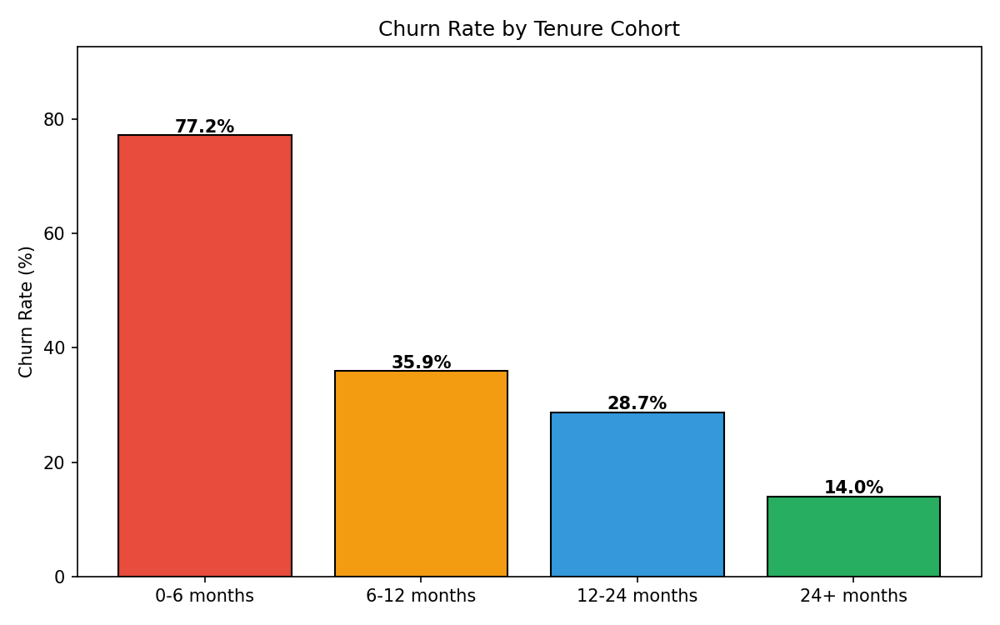
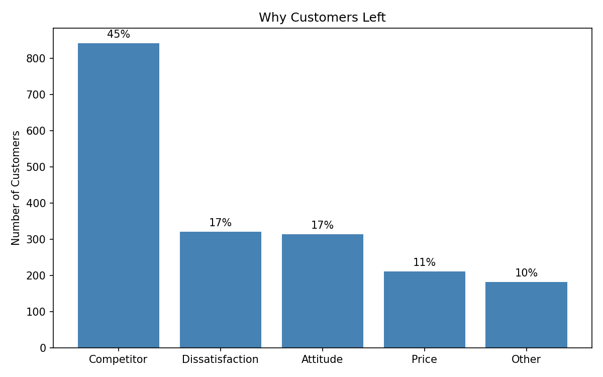
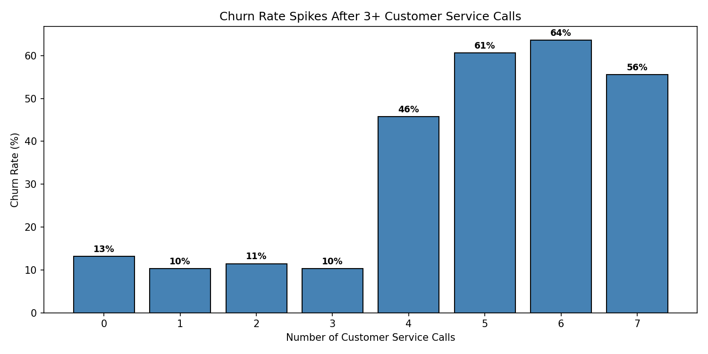
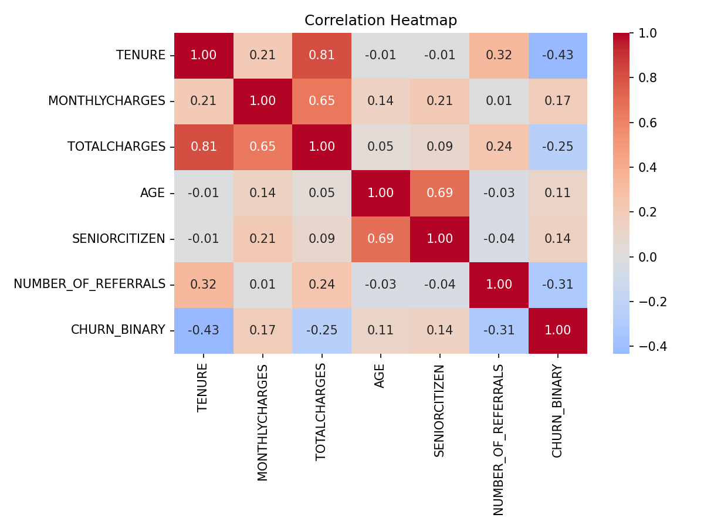
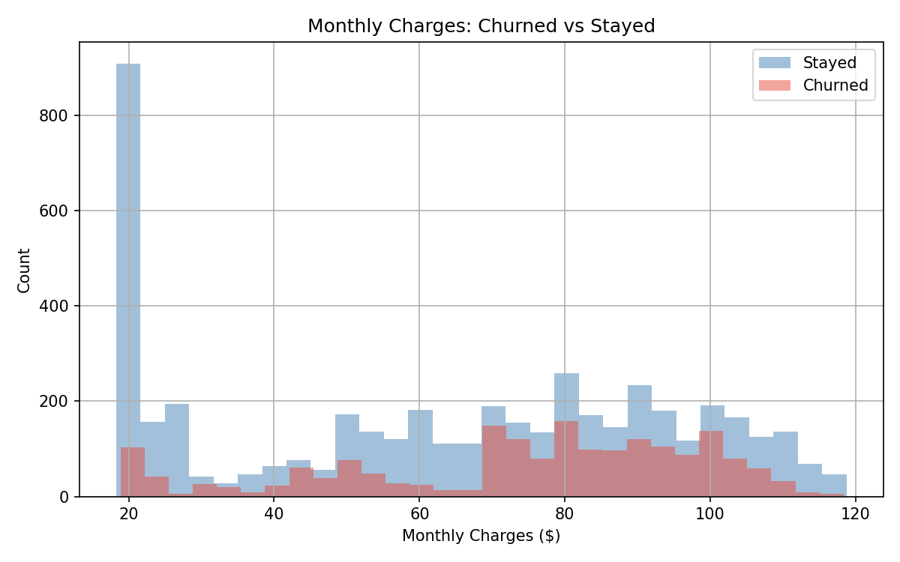
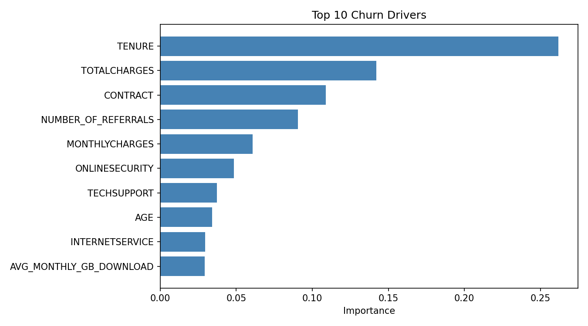
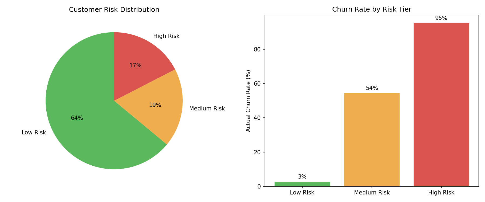

# Telecom Customer Churn Analysis

figuring out why telecom customers leave and what the company can do about it.

combined 3 datasets (~10,000 customers), cleaned and merged them in Snowflake, 
did EDA and predictive modeling in Python, and built a Streamlit app with a 
churn risk predictor.

## the problem

the company has a 28% churn rate. almost 1 in 3 customers are leaving. 
i wanted to find out who's churning, why, and what actions would actually 
help retain them.



## data sources

- **IBM Telco Customer Churn** (7,043 customers) — contract type, services, monthly charges, tenure, demographics
- **Maven Analytics Telecom Churn** (7,043 customers) — same customers as IBM but with extra columns: age, city, churn reason, total revenue. these two were joined on customer ID
- **Kaggle Telecoms Churn** (3,333 customers) — different customer base with usage minutes, customer service calls, state-level data

IBM + Maven were joined together (same customers, different columns). Kaggle Telecoms is a separate group analyzed independently.

## tools

- **Snowflake** — loaded raw CSVs, wrote SQL to clean and merge datasets
- **Python** — pandas, scikit-learn, matplotlib, seaborn
- **Streamlit** — interactive app with dashboard, explorer, risk predictor, playbook
- **Git/GitHub** — version control

## key findings

**contract type is the biggest factor.** month-to-month customers churn at 48% vs 2.8% for two-year contracts.



**first 6 months is the danger zone.** 77% of customers who leave do it in the first 6 months.



**45% left for a competitor.** not because of price (only 11% said that). competitors are poaching customers.



**customer service calls spike at 4+.** churn goes from ~11% to 46% after the 4th support call.



**tenure is the strongest predictor.** correlation of -0.43 with churn. longer tenure = less likely to leave.



**higher paying customers churn more.** churned customers skew toward the $60-120/mo range.



## model results

random forest classifier — 85% accuracy, 0.909 ROC AUC

top churn drivers: tenure, total charges, contract type, number of referrals, monthly charges



risk segmentation:
- low risk (0-30% probability): 4,215 customers, 2.6% actual churn
- medium risk (30-60%): 1,224 customers, 54% actual churn
- high risk (60-100%): 1,149 customers, 95% actual churn



## streamlit app

4 pages:
- **overview** — key metrics and charts
- **churn explorer** — filter by contract type, tenure, charges and see churn patterns update live
- **risk predictor** — input a customer profile and get churn probability with recommended actions
- **playbook** — retention triggers, revenue impact estimates, risk tier definitions

## project structure
```
telecom-churn-analysis/
├── app/                  streamlit app
├── data/processed/       cleaned data and model files
├── notebooks/            EDA and modeling notebooks
│   └── figures/          all charts and screenshots
├── sql/                  snowflake queries (explore + clean)
├── churn_playbook.md     business recommendations
├── requirements.txt
└── README.md
```

## how to run
```bash
# install dependencies
pip install -r requirements.txt

# set up .env file with snowflake credentials (or app will use csv fallback)
# SNOWFLAKE_USER, SNOWFLAKE_PASSWORD, SNOWFLAKE_ACCOUNT, SNOWFLAKE_WAREHOUSE, SNOWFLAKE_DATABASE

# run the streamlit app
streamlit run app/streamlit_app.py
```

## what i would improve with more time

- tune the model hyperparameters or try xgboost to improve recall on churned customers (currently 60%)
- add a tableau dashboard for a different visualization angle
- build out the kaggle telecoms analysis more — right now its mainly used for the service calls chart
- add time series analysis if i can find data with timestamps
- deploy with snowflake connection working on streamlit cloud (currently uses csv fallback)